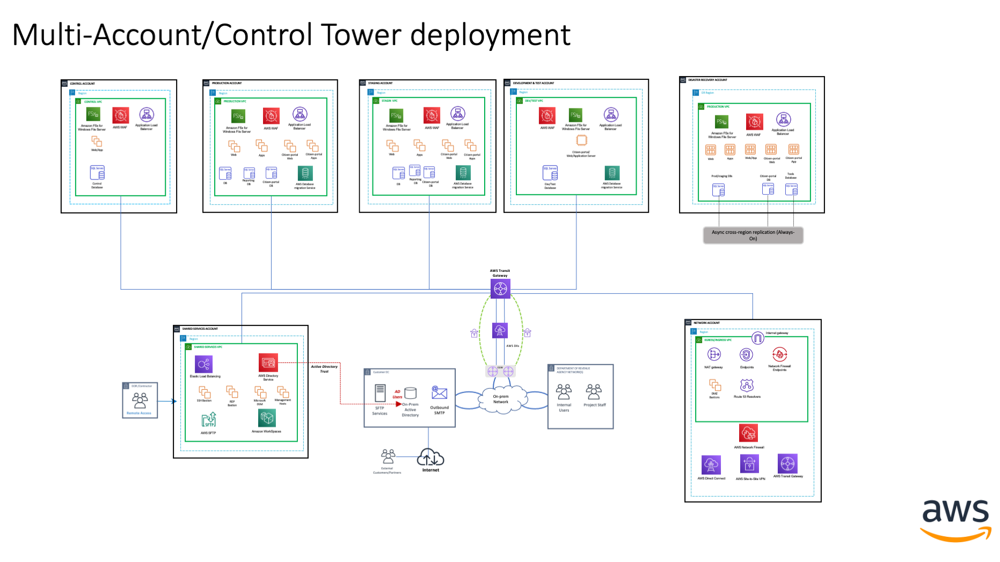
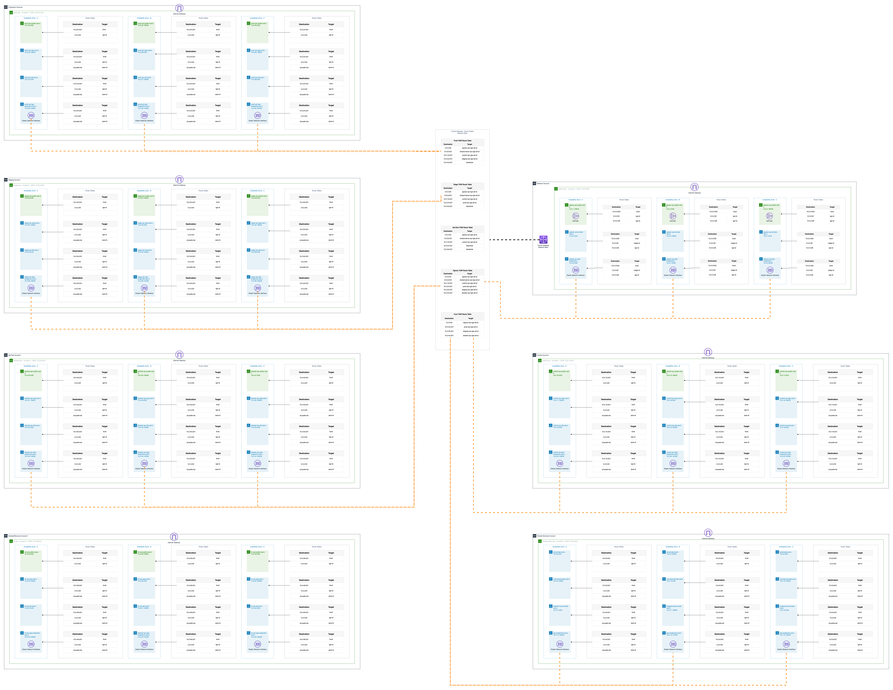

# Landing Zone Accelerator on AWS for Finance(Tax)

## What is Finance (Tax)?

The Finance (Tax) config aims to deploy an account structure commonly used with Tax workloads along with security controls and network configurations to secure Federal Tax Information (FTI) data.

The config provides the capability to easily enable additional security services, such as Amazon Macie. Detective guardrails are established through the use of Security Hub and Config, which deploy managed Config rules. These rules evaluate whether the configuration settings of your AWS resources comply with common best practices, such as CIS.  As an example these align with IRS cloud computing [Computer Security Evaluation Matrix (SCSEM)]. The accelerator deploys the account structure for Tax deployments along with security controls and network configurations to secure FTI data.

This project builds around best practices suitable for any organization. This LZA is not meant to be feature complete, but rather is intended to help accelerate cloud migrations and cloud refactoring efforts by organizations focused on election workloads. You will still need to tailor it to your unique business needs, however it does reduce much of the effort required to manually build a production-ready infrastrcture.

## Deployment Overview

Use the following steps to deploy the industry guidance. For detailed instructions, follow the links for each step.

[Step 1. Launch the stack](https://docs.aws.amazon.com/solutions/latest/landing-zone-accelerator-on-aws/step-1.-launch-the-stack.html)

* Launch the AWS CloudFormation template into your AWS account.
* Review the templates parameters and enter or adjust the default values as needed.

[Step 2. Await initial environment deployment](https://docs.aws.amazon.com/solutions/latest/landing-zone-accelerator-on-aws/step-2.-await-initial-environment-deployment.html)

* Await successful completion of `AWSAccelerator-Pipeline` pipeline.

Step 3. Copy the configuration files

* Clone the `aws-accelerator-config` AWS CodeCommit repository.
* Clone the [landing-zone-accelerator-on-aws](https://github.com/awslabs/landing-zone-accelerator-on-aws) repo
* Copy the contents from the `aws-best-practices-finance-tax` folder under `reference/sample-configurations` to your local `aws-accelerator-config` repo.  You may be prompted to over-write duplicate configs, such as `accounts-config.yaml`.

Step 4. Update the configuration files and release a change.

* Using the IDE of your choice.  Update the variables at the top of each config, such as `homeRegion`, to match where you deployed the solution to.
* Update the configuration files to match the desired state of your environment. Look for the `UPDATE` comments for areas requiring updates, such as e-mail addresses in your `accounts-config.yaml`
* Review the contents in the `Security Controls` section below to understand if any changes need to be made to meet organizational requirements, such as applying SCPs to the various OUs.
* Commit and push all your change to the `aws-accelerator-config` AWS CodeCommit repository.
* Release a change manually to the AWSAccelerator-Pipeline pipeline.

### Tax Reference Architecture Diagram

## Organizational Structure

Tax LZA accounts are generated and organized under Organizational Units (OUs) as follows:

- Root
  - Security
    - Log Archive
    - Audit
  - Tax
    - Production
    - Control
    - DevTest
    - Staging
    - DisasterRecovery
  - Infrastructure
    - Network
    - Shared Services
  - Management Account

By default the Tax LZA builds the above organizational structure, with the exception of the `Management Account` and `Security` OU, which are predefined by you prior to launching the LZA. The below architecture diagram highlights the key deployments:

* A `Tax` OU
  * Contains multiple AWS accounts based on reference architecture for deploying Tax workloads
  * Each contains a single VPC in `us-east-1`
  * Each VPC uses a /21 CIDR block in the 10.0.0.0/8 RFC-1918 range
* An `Infrastructure` OU
  * Contains one `Network` and one `SharedServices` Account
  * The `Network` account also contains a Transit Gateway for infrastructure routing
  * Each contains a single VPC in `us-east-2`
  * The `Network` VPC uses a /22 CIDR block and SharedServices a /21 in the 10.0.0.0/8 RFC-1918 range

There is an included [CSV Document](./ip-cidr-mapping-tax.csv) that provides a breakdown of the default CIDRs and subnet assignments.

## Tax LZA Network Diagram

## Network Considerations

- This LZA does not create DNS resources. You can create Private Hosted Zone for customer domain and associate it with workload VPCs for inter-VPC DNS resolution. Customer can also deploy inbound and outbound Route53 Resolvers for hybrid DNS resolution. 

## Security Considerations

All of the Finance LZA configuration files initially align with the default LZA best practices sample configuration for AWS. The Finance LZA configuration deviates from the best practices by defining the organization structure. It does this by leveraging a Tax OU with various accounts that align with the reference architecture and where FTI data will be expected to reside.

The Finance LZA provides the capability to easily enable additional security services, such as Amazon Macie. Detective guardrails are established through the use of Security Hub and Config, which deploy managed Config rules. These rules evaluate whether the configuration settings of your AWS resources comply with common best practices, such as CIS, that align with the cloud computing SCSEM

In the network-config.yaml file the configuration establishes the use of multiple network services such as AWS Transit Gateway. The Finance configuration leverages a central egress VPC.

Some additional considerations: in case a 3rd party (such as AMS) manages customer Tax environments, the CMK used to encrypt FTI data needs to be created in separate customer owned account to encrypt S3, EBS volumes and FSx shares or any other data stores storing FTI data in the Tax OU. Additionally, all the resources such as EC2 instances, EBS volumes, S3 buckets storing FTI data should be assigned a unique tag for access control purposes through IAM and SCP policies. The Application Load Balancers (ALB) deployed for the Tax application also needs to be enabled for FIPS 140-2 mode, please consult with your AWS team to meet your requirements.

### CloudWatch Metrics and Logging

CloudWatch metrics and alarms are deployed via the Tax LZA that align to IRS Pub 1075 requirements and the related CIS controls below. These can be reviewed and modified to meet your specific needs within the [Security Configuration] file.

- CIS 1.1 – Avoid the use of the "root" account
- CIS 3.1 – Ensure a log metric filter and alarm exist for unauthorized API calls
- CIS 3.2 – Ensure a log metric filter and alarm exist for AWS Management Console sign-in without MFA
- CIS 3.3 – Ensure a log metric filter and alarm exist for usage of "root" account
- CIS 3.4 – Ensure a log metric filter and alarm exist for IAM policy changes
- CIS 3.5 – Ensure a log metric filter and alarm exist for CloudTrail configuration changes
- CIS 3.8 – Ensure a log metric filter and alarm exist for S3 bucket policy changes
- CIS 3.12 – Ensure a log metric filter and alarm exist for changes to network gateways
- CIS 3.13 – Ensure a log metric filter and alarm exist for route table changes
- CIS 3.14 – Ensure a log metric filter and alarm exist for VPC changes

### Config rules implemented

The Tax LZA deploys AWS Config rules with automatic remidiation for ensuring S3 buckets are encrypted with the default AWS-managed SSE KMS key and ensures bucket versioning is enabled. You may want to consider customizing this rule to use a customer managed KMS key (CMK) in the event you have third parties with access to your account. Reach out to your AWS team to discuss further.

Additionally, the LZA for Tax also deploys a rule for checking to ensure EC2 instances have instances profile permissions applied for use with AWS Systems Manager (SSM) and SSM Session Manager.

## How to use the accelerator?

The Tax LZA can be deployed in a greenfield Control Tower deployment where a customer first deploys AWS Control Tower. Alternatively, customers can customize the accelerator configuration to deploy in an existing Control Tower environment or deploy specific Tax accelerator configurations based on their requirements. 

### Further considerations

Although the Tax LZA aims to be prescriptive in applying best practices for our customers, it intentionally avoids being *overly prescriptive* out of deference to the unique realities for each individual organization.  Consider the baseline Tax LZA as a good starting point related to the Tax reference architecture, but bear in mind your objectives as you begin to tailor it for your specific business requirements. From this perspective AWS provides resources that you should consult as you begin customizing your deployment of the Tax LZA:

1. This set of configuration files was tested with AWS Control Tower verions 3.0.  AWS Control Tower 3.0 supports the use of an AWS CloudTrail Organization Trail.  The global-config.yaml file shows organizationTail set to false because it is enabled through the AWS Control Tower setup.
2. Refer to the [Best Practices] for Organizational Units with AWS Organizations blog post for an overview.
3. [Recommended OUs and accounts].  This section of the `Organizing your AWS Environment Using Multiple Accounts` Whitepaper discusses the deployment of specific-purpose OUs in addition to the foundational ones established by the LZA.  For example, you may wish to establish a `Sandbox` OU for experimentation, a `Policy Staging` OU to safely test policy changes before deploying them more broadly, or a `Suspended` OU to hold, constrain, and eventually retire accounts that you no longer need.
4. [AWS Security Reference Architecture] (SRA). The SRA "is a holistic set of guidelines for deploying the full complement of AWS security services in a multi-account environment." This document is aimed at helping you to explore the "big picture" of AWS security and security-related services in order to determine the architectures most suited to your organization's unique security requirements.
5. Transit Gateway Flow logs are not enabled by default, work AWS team to determine if enabling TGW Flow logs help you meet your regulatory and organizational requirements.  
6. The Tax LZA does not implement MFA, but does deploy complimenting controls to require MFA for certain actions.
7. [IAM Best Practices]. This best practices document for planning and managing users/roles and policies is a good source for understanding how to establish a least-privilege permission posture for controlling access to your environment. 

<!-- Hyperlinks -->
[Security Configuration]: ./security-config.yaml
[IAM Best Practices]: https://docs.aws.amazon.com/IAM/latest/UserGuide/best-practices.html
[Best Practices]: https://aws.amazon.com/blogs/mt/best-practices-for-organizational-units-with-aws-organizations/
[Recommended OUs and accounts]: https://docs.aws.amazon.com/whitepapers/latest/organizing-your-aws-environment/recommended-ous-and-accounts.html
[AWS Security Reference Architecture]: https://docs.aws.amazon.com/prescriptive-guidance/latest/security-reference-architecture/welcome.html
[Implementation Guide]: https://docs.aws.amazon.com/solutions/latest/landing-zone-accelerator-on-aws/landing-zone-accelerator-on-aws.pdf
[LZA Accelerator]: https://github.com/awslabs/landing-zone-accelerator-on-aws
[Operational Best Practices for HIPAA Security]: https://docs.aws.amazon.com/config/latest/developerguide/operational-best-practices-for-hipaa_security.html
[VPC Sharing: key considerations and best practices]: https://aws.amazon.com/blogs/networking-and-content-delivery/vpc-sharing-key-considerations-and-best-practices/
[Computer Security Evaluation Matrix (SCSEM)]: https://www.irs.gov/privacy-disclosure/computer-security-compliance-references-and-related-topics
